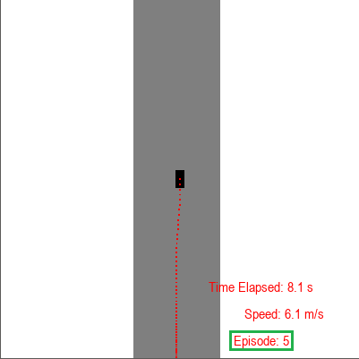

# OptimisedAutonomousRacing
Group Members: 
- Dinesh Magesvaran
- Prabhakaran Gokul
- Soh Wei-Jie

# Description of project 
(Details about the project attached in PDF)

# Installation
```conda create --name race_car python=3.6```

```conda activate race_car```

```pip install -r requirements.txt```

# File structure
Environment
- RaceCarEnv.py file is the Race Car environment
- Graphics.py is used by RaceCarEnv.py for rendering the simulation using pygame and OpenGL

NOTE: Episodes Information written in train24.txt will be overwritten with new data if any of the below actions are performed.

# Training a model
To train a model from scratch run the following commands:
1. Delete(better to back up) files and folders under the `checkpoints/data` folder.
2. ```conda activate race_car```
3. ```python main.py --validation False --load_checkpoint False```

# Training on top of a trained model


NOTE: Episode number resets from 1, even though it is training on top of the existing number of episodes. This is expected.

To train on top of the trained model, run the following commands:
1. ```conda activate race_car```
2. ```python main.py --validation False --load_checkpoint True```

# Validation
To validate the trained model, run the following commands:
1. ```conda activate race_car```
2. ```python main.py --validation True --load_checkpoint True```
